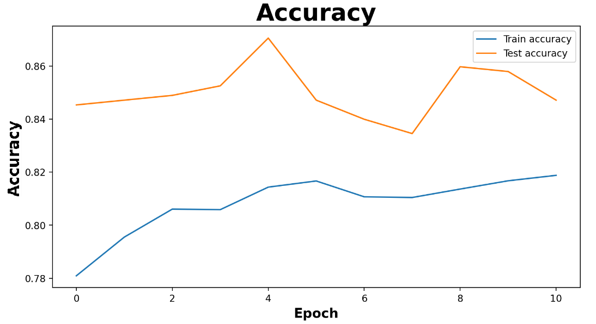
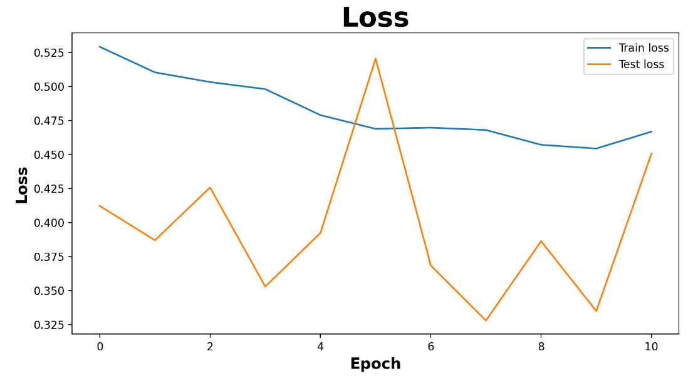
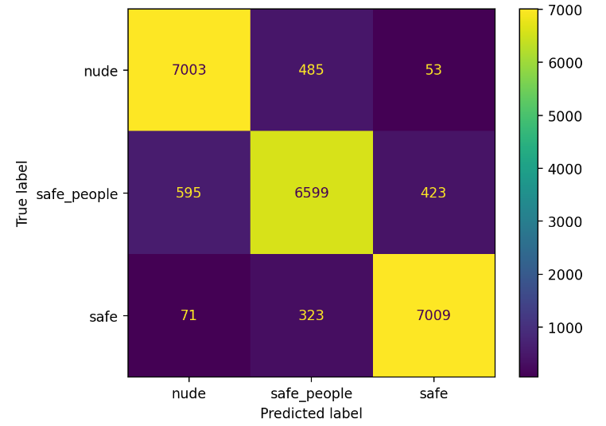

# Отчёт 

Это тиндер для геймеров на основе телеграм бота. Здесь геймеры могут найти себе союзника, соответствующего предпочтением и требованиям (пол, возраст, игры, рейтинг и др.). 
#
**Решаемая задача (проект развивает разработки с хакатона)**: Платформа для знакомств должна обеспечивать поддержание безопасной и приятной игровой среды и фильтровать контент, который может быть оскорбительным или неприемлемым.
На хакатоне мы начали внедрение в наш геймерский тиндер алгоритмов обнаружения неприемлемых изображений в профилях пользователей. Были рассмотрены варианты готовых решений (с HuggingFace или из открытых источников), а также нейросетевые архитектуры, подходящие для решения поставленной задачи. 

## Работа с данными

> В связи со специфичностью данных, используемых пользователями нашего бота, было принято решение обучать собственную модель на собранных командой специфичных данных. Говоря о специфичности данных, стоит отметить обилие сгенерированного и нереалистичного контента в сообществе геймеров: арты, рисунки, компьютерная графика, кадры из игр, мультфильмов, аниме, и т.д.). 
### Сбор данных
Датасеты, предназначенные для работы с NSFW контентом, которые можно было найти в открытом доступе, плохо соответствовали специфике решаемой нами задачи. В первую очередь было решено разделить задачу поиска NSFW контента на две более простые задачи: 
1) поиск трэш-контента (различные отображения жестокости и других недопустимых сцен)
2) поиск порнографического контента

Размеченных данных для решения первой из выделенных задач в открытом доступе не было, поэтому командой был собран уникальный датасет, размеченный вручную. 

Для решения второй задачи мы смогли найти несколько крупных наборов данных на HuggingFace ([28000 изображений](https://huggingface.co/datasets/deepghs/nsfw_detect) и более чем 600000 изображений). Обработав имеющиеся наборы данных, команда выделила несколько проблем у имеющихся датасетов (такие как несбалансированность классов, содержание большого числа выбросов классах с "безопасными" изображениями, расплывчатость границы "безопасности" датасетов, маленькое количество изображений из категории UGC-контента, низкое качество некоторых изображений датасетов), вследствие чего датасеты были переработаны (очищены и дополнены, некоторые переразмечены) вручную.
### Разметка данных
> *Для полноты экспериментов были исследованы как разбиения, учитывающие специфику геймерского комьюнити (упор на UGC-контент), так и не учитывающие её (UGC-контент и реалистичные изображения не разграничивались)*
#### Эксперименты с trash-контентом
Для 1-й подзадачи было рассмотрено 2 варианта разбиения: 
- [x] 2-х классовое (trash/safe) 
- [x] 5-ти классовое ( trash/safe/draw_trash/draw_safe/meet) 

Для каждого разбиения модель была обучена на 10 эпохах:

<table><tr><th colspan="3" valign="top">
Эпоха/Разбиение
</th><th valign="top">0</th><th valign="top">1</th><th valign="top">2</th><th valign="top">3</th><th valign="top">4</th><th valign="top">5</th><th valign="top">6</th><th valign="top">7</th><th valign="top">8</th><th valign="top">9</th></tr>
<tr><td rowspan="4" valign="top">На 5 классов</td><td rowspan="2" valign="top">Loss</td><td valign="top">train</td><td valign="top">0.6450</td><td valign="top">0.4815</td><td valign="top">0.4344</td><td valign="top">0.3811</td><td valign="top">0.3521</td><td valign="top">0.3369</td><td valign="top">0.3051</td><td valign="top">0.2898</td><td valign="top">0.2684</td><td valign="top">0.2612</td></tr>
<tr><td valign="top">test</td><td valign="top">1.0641</td><td valign="top">0.8296</td><td valign="top">0.6106</td><td valign="top">0.4551</td><td valign="top">0.5669</td><td valign="top">0.5126</td><td valign="top">0.5324</td><td valign="top">0.4935</td><td valign="top">0.6361</td><td valign="top">0.3882</td></tr>
<tr><td rowspan="2" valign="top">Accuracy</td><td valign="top">train</td><td valign="top">0.7727</td><td valign="top">0.8204</td><td valign="top">0.8474</td><td valign="top">0.8698</td><td valign="top">0.8745</td><td valign="top">0.8828</td><td valign="top">0.8917</td><td valign="top">0.8977</td><td valign="top">0.9052</td><td valign="top">0.9082</td></tr>
<tr><td valign="top">test</td><td valign="top">0.6127</td><td valign="top">0.7078</td><td valign="top">0.7496</td><td valign="top">0.8397</td><td valign="top">0.7780</td><td valign="top">0.8164</td><td valign="top">0.8097</td><td valign="top">0.8063</td><td valign="top">0.7997</td><td valign="top">0.8698</td></tr>
<tr><th rowspan="4" valign="top">На 2 класса </th><th rowspan="2" valign="top">Loss</th><th valign="top">train</th><th valign="top">0.3119</th><th valign="top">0.2408</th><th valign="top">0.2181</th><th valign="top">0.2008</th><th valign="top">0.1837</th><th valign="top">0.1634</th><th valign="top">0.1621</th><th valign="top">0.1524</th><th valign="top">0.1420</th><th valign="top">0.1332</th></tr>
<tr><td valign="top">test</td><td valign="top">0.5479</td><td valign="top">0.4510</td><td valign="top">0.3467</td><td valign="top">0.2964</td><td valign="top">0.3886</td><td valign="top">0.3108</td><td valign="top">0.5639</td><td valign="top">0.2802</td><td valign="top">0.4233</td><td valign="top">0.2642</td></tr>
<tr><td rowspan="2" valign="top">Accuracy</td><td valign="top">train</td><td valign="top">0.8706</td><td valign="top">0.9009</td><td valign="top">0.9119</td><td valign="top">0.9213</td><td valign="top">0.9287</td><td valign="top">0.9349</td><td valign="top">0.9368</td><td valign="top">0.9405</td><td valign="top">0.9439</td><td valign="top">0.9462</td></tr>
<tr><td valign="top">test</td><td valign="top">0.6949</td><td valign="top">0.7894</td><td valign="top">0.8720</td><td valign="top">0.8898</td><td valign="top">0.8366</td><td valign="top">0.8642</td><td valign="top">0.7500</td><td valign="top">0.8937</td><td valign="top">0.8189</td><td valign="top">0.9035</td></tr>

</table>

#### Визуализация экспериментов двухклассвого разбиения trash-контента

График ошибки при обучении | График качества при обучении
:-------------------------:|:-------------------------:
|||

Тренировочная матрица ошибок            |  Тестовая матрица ошибок
:-------------------------:|:-------------------------:
|  |  

#### Визуализация экспериментов пятиклассвого разбиения trash-контента

График ошибки при обучении | График качества при обучении
:-------------------------:|:-------------------------:
|||

Тренировочная матрица ошибок            |  Тестовая матрица ошибок
:-------------------------:|:-------------------------:
|  |  

#### Эксперименты с nude-контентом

Для 2-й подзадачи изначально было создано 3 варианта разбиения: 
- [x] 2-х классовое (nude/safe)
- [x] 3-х классовое (nude/marginal/safe)
- [x] 5-ти классовое (porn/sexy/hentai/draw/safe)

> После обучения на данных разбиениях была обнаружена закономерность в предсказаниях (модель отмечала большое число изображений с людьми, как недопустимый контент, даже когда изображения были "безопасными"). Для решения этой проблемы был создан ещё один вариант 3-х классового разбиения:
> 
- [x] 3-х классовое (nude/safe_people/safe)

Для каждого разбиения модель была обучена на 11 эпохах:

<table><tr><th colspan="3" valign="top">
Разбиение / Эпоха

</th><th valign="top">0</th><th valign="top">1</th><th valign="top">2</th><th valign="top">3</th><th valign="top">4</th><th valign="top">5</th><th valign="top">6</th><th valign="top">7</th><th valign="top">8</th><th valign="top">9</th><th valign="top">10</th></tr>
<tr><td rowspan="4" valign="top">На 2 класса</td><td rowspan="2" valign="top">Loss</td><td valign="top">train</td><td valign="top">0.4614</td><td valign="top">0.4454</td><td valign="top">0.4261</td><td valign="top">0.4256</td><td valign="top">0.4168</td><td valign="top">0.4104</td><td valign="top">0.4206</td><td valign="top">0.4118</td><td valign="top">0.4159</td><td valign="top">0.4093</td><td valign="top">0.4614</td></tr>
<tr><td valign="top">test</td><td valign="top">0.3258</td><td valign="top">0.3355</td><td valign="top">0.3398</td><td valign="top">0.3222</td><td valign="top">0.3040</td><td valign="top">0.3449</td><td valign="top">0.3475</td><td valign="top">0.3182</td><td valign="top">0.3182</td><td valign="top">0.3388</td><td valign="top">0.3258</td></tr>
<tr><td rowspan="2" valign="top">Accuracy</td><td valign="top">train</td><td valign="top">0.7809</td><td valign="top">0.7955</td><td valign="top">0.8060</td><td valign="top">0.8058 </td><td valign="top">0.8143</td><td valign="top">0.8166</td><td valign="top">0.8107</td><td valign="top">0.8104</td><td valign="top">0.8136</td><td valign="top">0.8167</td><td valign="top">0.7809</td></tr>
<tr><td valign="top">test</td><td valign="top">0.8453</td><td valign="top">0.8471</td><td valign="top">0.8489</td><td valign="top">0.8525</td><td valign="top">0.8705</td><td valign="top">0.8471</td><td valign="top">0.8399</td><td valign="top">0.8345</td><td valign="top">0.8597</td><td valign="top">0.8579</td><td valign="top">0.8453</td></tr>
<tr><td rowspan="4" valign="top">На 3 класса</td><td rowspan="2" valign="top">Loss</td><td valign="top">train</td><td valign="top">0.5907</td><td valign="top">0.5384</td><td valign="top">0.5148</td><td valign="top">0.5229</td><td valign="top">0.4992</td><td valign="top">0.5122</td><td valign="top">0.4982</td><td valign="top">0.4946</td><td valign="top">0.5021</td><td valign="top">0.4906</td><td valign="top">0.5907</td></tr>
<tr><td valign="top">test</td><td valign="top">0.6558</td><td valign="top">0.5281</td><td valign="top">0.6888</td><td valign="top">0.5923</td><td valign="top">0.7714</td><td valign="top">0.5635</td><td valign="top">0.5114</td><td valign="top">0.5233</td><td valign="top">0.5403</td><td valign="top">0.5196</td><td valign="top">0.6558</td></tr>
<tr><td rowspan="2" valign="top">Accuracy</td><td valign="top">train</td><td valign="top">0.7523</td><td valign="top">0.7811</td><td valign="top">0.7916</td><td valign="top">0.7913</td><td valign="top">0.7975</td><td valign="top">0.7962</td><td valign="top">0.8032</td><td valign="top">0.8035</td><td valign="top">0.8026</td><td valign="top">0.8038</td><td valign="top">0.7523</td></tr>
<tr><td valign="top">test</td><td valign="top">0.7824</td><td valign="top">0.8075</td><td valign="top">0.7405</td><td valign="top">0.8033</td><td valign="top">0.7489</td><td valign="top">0.8179</td><td valign="top">0.8284</td><td valign="top">0.8263</td><td valign="top">0.8305</td><td valign="top">0.8242</td><td valign="top">0.7824</td></tr>
<tr><td rowspan="4" valign="top">На 5 классов</td><td rowspan="2" valign="top">Loss</td><td valign="top">train</td><td valign="top">0.7040</td><td valign="top">0.6373</td><td valign="top">0.6323</td><td valign="top">0.6115</td><td valign="top">0.5948</td><td valign="top">0.5737</td><td valign="top">0.5791</td><td valign="top">0.5645</td><td valign="top">0.5806</td><td valign="top">0.5630</td><td valign="top">0.7040</td></tr>
<tr><td valign="top">test</td><td valign="top">0.4395</td><td valign="top">0.4894</td><td valign="top">0.5356</td><td valign="top">0.4324</td><td valign="top">0.4256</td><td valign="top">0.4675</td><td valign="top">0.4957</td><td valign="top">0.5005</td><td valign="top">0.3834</td><td valign="top">0.5066</td><td valign="top">0.4395</td></tr>
<tr><td rowspan="2" valign="top">Accuracy</td><td valign="top">train</td><td valign="top">0.7245</td><td valign="top">0.7573</td><td valign="top">0.7662</td><td valign="top">0.7682</td><td valign="top">0.7782</td><td valign="top">0.7843</td><td valign="top">0.7829</td><td valign="top">0.7863</td><td valign="top">0.7838</td><td valign="top">0.7927</td><td valign="top">0.7245</td></tr>
<tr><td valign="top">test</td><td valign="top">0.8216</td><td valign="top">0.8210 </td><td valign="top">0.7990</td><td valign="top">0.8463</td><td valign="top">0.8380</td><td valign="top">0.8240</td><td valign="top">0.8210</td><td valign="top">0.8046</td><td valign="top">0.8460 </td><td valign="top">0.8173</td><td valign="top">0.8216</td></tr>
<tr><td rowspan="4" valign="top">На 3 класса (включая людей)</td><td rowspan="2" valign="top">Loss</td><td valign="top">train</td><td valign="top">0.5514</td><td valign="top">0.5134</td><td valign="top">0.4997</td><td valign="top">0.4871</td><td valign="top">0.4989</td><td valign="top">0.4706</td><td valign="top">0.4912</td><td valign="top">0.4751</td><td valign="top">0.4542</td><td valign="top">0.4687</td><td valign="top">0.5514</td></tr>
<tr><td valign="top">test</td><td valign="top">0.4245</td><td valign="top">0.4259</td><td valign="top">0.4048</td><td valign="top">0.4905</td><td valign="top">0.3425</td><td valign="top">0.3356</td><td valign="top">0.3665</td><td valign="top">0.3165</td><td valign="top">0.4020</td><td valign="top">0.3835</td><td valign="top">0.4245</td></tr>
<tr><td rowspan="2" valign="top">Accuracy</td><td valign="top">train</td><td valign="top">0.7697</td><td valign="top">0.7952</td><td valign="top">0.7989</td><td valign="top">0.8047</td><td valign="top">0.8005</td><td valign="top">0.8125</td><td valign="top">0.8091</td><td valign="top">0.8139</td><td valign="top">0.8188</td><td valign="top">0.8164</td><td valign="top">0.7697</td></tr>
<tr><td valign="top">test</td><td valign="top">0.8369</td><td valign="top">0.8405</td><td valign="top">0.8465</td><td valign="top">0.7985</td><td valign="top">0.8489</td><td valign="top">0.8585</td><td valign="top">0.8429</td><td valign="top">0.8752</td><td valign="top">0.8393</td><td valign="top">0.8249</td><td valign="top">0.8369</td></tr>
</table>

#### Визуализация экспериментов двухклассвого разбиения nude-контента

График ошибки при обучении | График качества при обучении
:-------------------------:|:-------------------------:
|||

Тренировочная матрица ошибок            |  Тестовая матрица ошибок
:-------------------------:|:-------------------------:
|  |  

#### Визуализация экспериментов трёхклассового разбиения nude-контента

График ошибки при обучении | График качества при обучении
:-------------------------:|:-------------------------:
|||

Тренировочная матрица ошибок            |  Тестовая матрица ошибок
:-------------------------:|:-------------------------:
|  |  

##### Визуализация экспериментов пятиклассового разбиения nude-контента

График ошибки при обучении | График качества при обучении
:-------------------------:|:-------------------------:
|||

Тренировочная матрица ошибок            |  Тестовая матрица ошибок
:-------------------------:|:-------------------------:
|  |  

##### Визуализация экспериментов трёхклассового разбиения nude-контента с подклассом людей

##### График ошибки при обучении
График ошибки при обучении | График качества при обучении
:-------------------------:|:-------------------------:
|_class_loss.png)|_class_acc.png)|

Тренировочная матрица ошибок            |  Тестовая матрица ошибок
:-------------------------:|:-------------------------:
|_class_train_matrix.png "Тренировочная матрица ошибок")  |  _class_test_matrix.png "Тестовая матрица ошибок")

Проанализировав эксперименты с разбиениями данных, команда приняла решение остановиться на 3-х классовом рабиении, в котором изображения с людьми были выделены в отдельный класс.

## Работа с моделями
> Было решено использовать ансамбль модели для определения треш-контента и модели для поиска нуд-контента.
> 
### Подбор архитектуры

Так как поставленная задача требовала высокой точности, командой было проведено обширное исследование различных моделей, используемых для поиска nsfw-контента (как из открытых источников, так и более финансово затратных решений).

Такие компании, как Google, Microsoft, Amazon, находятся на переднем крае исследований в области компьютерного зрения. Естественно, решения этих компаний для фильтрации NSFW контента имеют много преимуществ, таких как большая точность (от 88% до 95%) или наличие огромного массива данных для обучения и совершенствования. Однако, несмотря на все преимущества моделей этих компаний, качество их предсказаний значительно снижается, когда дело доходит до User-Generated Content NSFW. 

По статистике качество NSFW алгоритмов снижается примерно на 5%, на практике результат ухудшается ещё сильнее. 
Так как решаемая нашей командой задача очень тесно связанна с UGC контентом, необходимо учитывать насколько критично блокировать UGC NSFW изображения. 

В рамках исследований нашей командой были рассмотрены различные open source решения, такие как [NudeNet](https://pypi.org/project/nudenet/), [nsfw-detector](https://pypi.org/project/nsfw-detector/) и другие. Такие решения не только уступали по качеству моделям от компаний-гигантов, но также показали более низкие результаты для UGC NSFW изображений.

По многочисленным исследованиям в области обнаружениябученная недопустимого контента, была выделена предобученная модель ResNet, дообученная на специфичном разбиении данных.

Были проведены эксперементы с nude-данными для 2-х сетей ResNet:
- [x] ResNet50
- [x] ResNet101

В качестве модели для сети TrashNet была использована компактная предобученная нейросеть:
- [x] MobileNet

### Эксперименты с nude-данными:

Для обоих вариаций архитекрур были обучены некоторые их их слоёв. Результаты экспериментов представлены в таблице: 

<table><tr><th rowspan="2" valign="top">Модель</th><th rowspan="2" valign="top">Активные слои</th><th colspan="2" valign="top">
Лучшее 

тренировочное

качество 
</th><th colspan="2" valign="top">Лучшее тестовое качество</th><th colspan="2" valign="top">Лучшая тренировочная ошибка</th><th colspan="2" valign="top">Лучшая тестовая ошибка</th></tr>
<tr><td valign="top">Значение</td><td valign="top">Эпоха</td><td valign="top">Значение</td><td valign="top">Эпоха</td><td valign="top">Значение</td><td valign="top">Эпоха</td><td valign="top">Значение</td><td valign="top">Эпоха</td></tr>
<tr><td rowspan="4" valign="top">ResNet50</td><td valign="top">все</td><td valign="top">0.8246</td><td valign="top">10</td><td valign="top">0.7961</td><td valign="top">8</td><td valign="top">0.4184</td><td valign="top">10</td><td valign="top">0.4739</td><td valign="top">10</td></tr>
<tr><td valign="top">2,3,4</td><td valign="top">0.8224</td><td valign="top">9</td><td valign="top">0.8585</td><td valign="top">8</td><td valign="top">0.4535</td><td valign="top">9</td><td valign="top">0.3411</td><td valign="top">4</td></tr>
<tr><td valign="top">3,4</td><td valign="top">0.8204</td><td valign="top">10</td><td valign="top">0.8752</td><td valign="top">7</td><td valign="top">0.4542</td><td valign="top">8</td><td valign="top">0.3165</td><td valign="top">7</td></tr>
<tr><td valign="top">4</td><td valign="top">0.8184</td><td valign="top">9</td><td valign="top">0.8609</td><td valign="top">4</td><td valign="top">0.4543</td><td valign="top">9</td><td valign="top">0.3279</td><td valign="top">7</td></tr>
<tr><td rowspan="4" valign="top">ResNet101</td><td valign="top">все</td><td valign="top">0.8034</td><td valign="top">10</td><td valign="top">0.7601</td><td valign="top">9</td><td valign="top">0.4607</td><td valign="top">10</td><td valign="top">0.5379</td><td valign="top">10</td></tr>
<tr><td valign="top">2,3,4</td><td valign="top">0.9734</td><td valign="top">10</td><td valign="top">0.8956</td><td valign="top">10</td><td valign="top">0.0687</td><td valign="top">10</td><td valign="top">0.2803</td><td valign="top">2</td></tr>
<tr><td valign="top">3,4</td><td valign="top">0.9754</td><td valign="top">9</td><td valign="top">0.8884</td><td valign="top">10</td><td valign="top">0.0661</td><td valign="top">10</td><td valign="top">0.5220</td><td valign="top">4</td></tr>
<tr><td valign="top">4</td><td valign="top">0.9577</td><td valign="top">10</td><td valign="top">0.8764</td><td valign="top">6</td><td valign="top">0.1136</td><td valign="top">10</td><td valign="top">0.4122</td><td valign="top">9</td></tr>
</table>

### Визуализация экспериментов для ResNet50

#### Графики ошибки при обучении

|Активные слои: 4| Активные слои: 3,4|Активные слои: 2,3,4|Активные слои: все|
:-------------------------:|:-------------------------:|:-------------------------:|:-------------------------:
||_class_loss.png)|||

#### Графики качества при обучении

Активные слои: 4| Активные слои: 3,4|Активные слои: 2,3,4|Активные слои: все
:-------------------------:|:-------------------------:|:-------------------------:|:-------------------------:
||_class_acc.png)|||

Тренировочная матрица ошибок            |  Тестовая матрица ошибок
:-------------------------:|:-------------------------:
|Активные слои: 4|
|  |  
|Активные слои: 3,4|
|_class_train_matrix.png "Тренировочная матрица ошибок")  |  _class_test_matrix.png "Тестовая матрица ошибок")
|Активные слои: 2,3,4|
|  |  
|Активные слои: все|
|  |  

### Визуализация экспериментов для ResNet101

#### Графики ошибки при обучении

|Активные слои: 4| Активные слои: 3,4|Активные слои: 2,3,4|Активные слои: все|
:-------------------------:|:-------------------------:|:-------------------------:|:-------------------------:
|||||

#### Графики качества при обучении

Активные слои: 4| Активные слои: 3,4|Активные слои: 2,3,4|Активные слои: все
:-------------------------:|:-------------------------:|:-------------------------:|:-------------------------:
|||||

Тренировочная матрица ошибок            |  Тестовая матрица ошибок
:-------------------------:|:-------------------------:
|Активные слои: 4|
|  |  
|Активные слои: 3,4|
|  |  
|Активные слои: 2,3,4|
|  |  
|Активные слои: все|
|  |  

## Работа с параметрами моделей
> В качестве исследуемых параметров для обучения были выбраны оптимизатор и шаг градиентного спуска
> 
Для обеих подзадач были перебраны следующие наборы параметров:

#### Learning rate               
- [x] lr = 1e-3                  
- [x] lr = 1e-4                   
- [x] lr = 1e-5                   

#### Оптимизаторы
- [x] SGD
- [x] AdaGrad
- [x] Adam

### Подбор Оптимизатора

#### Эксперименты с моделью TrashNet

<table><tr><th rowspan="2" valign="top">Оптимизатор</th><th colspan="2" valign="top">
Лучшее 

тренировочное

качество 
</th><th colspan="2" valign="top">Лучшее тестовое качество</th><th colspan="2" valign="top">Лучшая тренировочная ошибка</th><th colspan="2" valign="top">Лучшая тестовая ошибка</th></tr>
<tr><td valign="top">Значение</td><td valign="top">Эпоха</td><td valign="top">Значение</td><td valign="top">Эпоха</td><td valign="top">Значение</td><td valign="top">Эпоха</td><td valign="top">Значение</td><td valign="top">Эпоха</td></tr>
<tr><td valign="top">SGD</td><td valign="top">0.9489</td><td valign="top">10</td><td valign="top">0.909</td><td valign="top">8</td><td valign="top">0.1525</td><td valign="top">10</td><td valign="top">0.2494</td><td valign="top">10</td></tr>
<tr><td valign="top">AdaGrad</td><td valign="top">0.9923</td><td valign="top">10</td><td valign="top">0.9265</td><td valign="top">2</td><td valign="top">0.0289</td><td valign="top">10</td><td valign="top">0.2503</td><td valign="top">9</td></tr>
<tr><td valign="top">Adam</td><td valign="top">0.9082</td><td valign="top">9</td><td valign="top">0.8698</td><td valign="top">9</td><td valign="top">0.2612</td><td valign="top">9</td><td valign="top">0.3882</td><td valign="top">9</td></tr>
</table>

### Визуализация экспериментов для TrashNet

#### Графики ошибки при обучении

|SGD| ADAGRAD| ADAM|
:-------------------------:|:-------------------------:|:-------------------------:
||||
#### Графики качества при обучении

|SGD| ADAGRAD|ADAM|
:-------------------------:|:-------------------------:|:-------------------------:
||||

Тренировочная матрица ошибок            |  Тестовая матрица ошибок
:-------------------------:|:-------------------------:
|SGD|
|  |  
|ADAGRAD|
|  |  
|ADAM|
|  |  

#### Эксперименты с моделью NudeNet

<table><tr><th rowspan="2" valign="top">Оптимизатор</th><th colspan="2" valign="top">
Лучшее 

тренировочное

качество 
</th><th colspan="2" valign="top">Лучшее тестовое качество</th><th colspan="2" valign="top">Лучшая тренировочная ошибка</th><th colspan="2" valign="top">Лучшая тестовая ошибка</th></tr>
<tr><td valign="top">Значение</td><td valign="top">Эпоха</td><td valign="top">Значение</td><td valign="top">Эпоха</td><td valign="top">Значение</td><td valign="top">Эпоха</td><td valign="top">Значение</td><td valign="top">Эпоха</td></tr>
<tr><td valign="top">SGD</td><td valign="top">0.9687</td><td valign="top">10</td><td valign="top">0.8920</td><td valign="top">10</td><td valign="top">0.0952</td><td valign="top">10</td><td valign="top">0.2832</td><td valign="top">3</td></tr>
<tr><td valign="top">AdaGrad</td><td valign="top">0\.8884</td><td valign="top">9</td><td valign="top">0.9019</td><td valign="top">10</td><td valign="top">0.2506</td><td valign="top">10</td><td valign="top">0.2849</td><td valign="top">7</td></tr>
<tr><td valign="top">Adam</td><td valign="top">0.8204</td><td valign="top">10</td><td valign="top">0.8752</td><td valign="top">7</td><td valign="top">0.4542</td><td valign="top">8</td><td valign="top">0.3165</td><td valign="top">7</td></tr>
</table>

### Визуализация экспериментов для NudeNet

#### Графики ошибки при обучении

|SGD| ADAGRAD|ADAM|
:-------------------------:|:-------------------------:|:-------------------------:
||||
#### Графики качества при обучении

|SGD| ADAGRAD|ADAM|
:-------------------------:|:-------------------------:|:-------------------------:
||||

Тренировочная матрица ошибок            |  Тестовая матрица ошибок
:-------------------------:|:-------------------------:
|SGD|
|  |  
|ADAGRAD|
|  |  
|ADAM|
|  |  

### Подбор Learning rate

#### Эксперименты с моделью TrashNet

<table><tr><th rowspan="2" valign="top">Learning rate</th><th colspan="2" valign="top">
Лучшее 

тренировочное

качество 
</th><th colspan="2" valign="top">Лучшее тестовое качество</th><th colspan="2" valign="top">Лучшая тренировочная ошибка</th><th colspan="2" valign="top">Лучшая тестовая ошибка</th></tr>
<tr><td valign="top">Значение</td><td valign="top">Эпоха</td><td valign="top">Значение</td><td valign="top">Эпоха</td><td valign="top">Значение</td><td valign="top">Эпоха</td><td valign="top">Значение</td><td valign="top">Эпоха</td></tr>
<tr><td valign="top">lr = 1e-3</td><td valign="top">0.7508</td><td valign="top">10</td><td valign="top">0.5726</td><td valign="top">10</td><td valign="top">0.6757</td><td valign="top">10</td><td valign="top">1.0316</td><td valign="top">5</td></tr>
<tr><td valign="top">lr = 1e-4</td><td valign="top">0.9082</td><td valign="top">9</td><td valign="top">0.8698</td><td valign="top">9</td><td valign="top">0.2612</td><td valign="top">9</td><td valign="top">0.3882</td><td valign="top">9</td></tr>
<tr><td valign="top">lr = 1e-5</td><td valign="top">0.9865</td><td valign="top">10</td><td valign="top">0.9315</td><td valign="top">0</td><td valign="top">0.0403</td><td valign="top">10</td><td valign="top">0.2047</td><td valign="top">0</td></tr>
</table>

### Визуализация экспериментов для TrashNet

#### Графики ошибки при обучении

|lr = 1e-3| lr = 1e-4|lr = 1e-5|
:-------------------------:|:-------------------------:|:-------------------------:
||||
#### Графики качества при обучении

|lr = 1e-3| lr = 1e-4|lr = 1e-5|
:-------------------------:|:-------------------------:|:-------------------------:
||||

Тренировочная матрица ошибок            |  Тестовая матрица ошибок
:-------------------------:|:-------------------------:
|lr = 1e-3|
|  |  
|lr = 1e-4|
|  |  
|lr = 1e-5|
|  |  

#### Эксперименты с моделью NudeNet

<table><tr><th rowspan="2" valign="top">Learning rate</th><th colspan="2" valign="top">
Лучшее 

тренировочное

качество 
</th><th colspan="2" valign="top">Лучшее тестовое качество</th><th colspan="2" valign="top">Лучшая тренировочная ошибка</th><th colspan="2" valign="top">Лучшая тестовая ошибка</th></tr>
<tr><td valign="top">Значение</td><td valign="top">Эпоха</td><td valign="top">Значение</td><td valign="top">Эпоха</td><td valign="top">Значение</td><td valign="top">Эпоха</td><td valign="top">Значение</td><td valign="top">Эпоха</td></tr>
<tr><td valign="top">lr = 1e-3</td><td valign="top">0.9301</td><td valign="top">10</td><td valign="top">0.8920</td><td valign="top">8</td><td valign="top">0.1827</td><td valign="top">10</td><td valign="top">0.3122</td><td valign="top">2</td></tr>
<tr><td valign="top">lr = 1e-4</td><td valign="top">0.8204</td><td valign="top">10</td><td valign="top">0.8752</td><td valign="top">7</td><td valign="top">0.4542</td><td valign="top">8</td><td valign="top">0.3165</td><td valign="top">7</td></tr>
<tr><td valign="top">lr = 1e-5</td><td valign="top">0.9833</td><td valign="top">10</td><td valign="top">0.8968</td><td valign="top">9</td><td valign="top">0.0483</td><td valign="top">10</td><td valign="top">0.2735</td><td valign="top">1</td></tr>
</table>

### Визуализация экспериментов для NudeNet

#### Графики ошибки при обучении

|lr = 1e-3| lr = 1e-4|lr = 1e-5|
:-------------------------:|:-------------------------:|:-------------------------:
||||
#### Графики качества при обучении

|lr = 1e-3| lr = 1e-4|lr = 1e-5|
:-------------------------:|:-------------------------:|:-------------------------:
||||

Тренировочная матрица ошибок            |  Тестовая матрица ошибок
:-------------------------:|:-------------------------:
|lr = 1e-3|
|  |  
|lr = 1e-4|
|  |  
|lr = 1e-5|
|  |  
